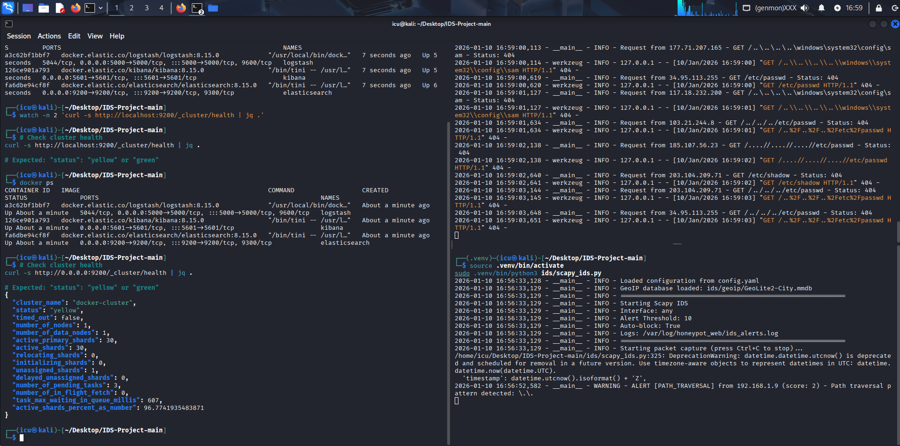
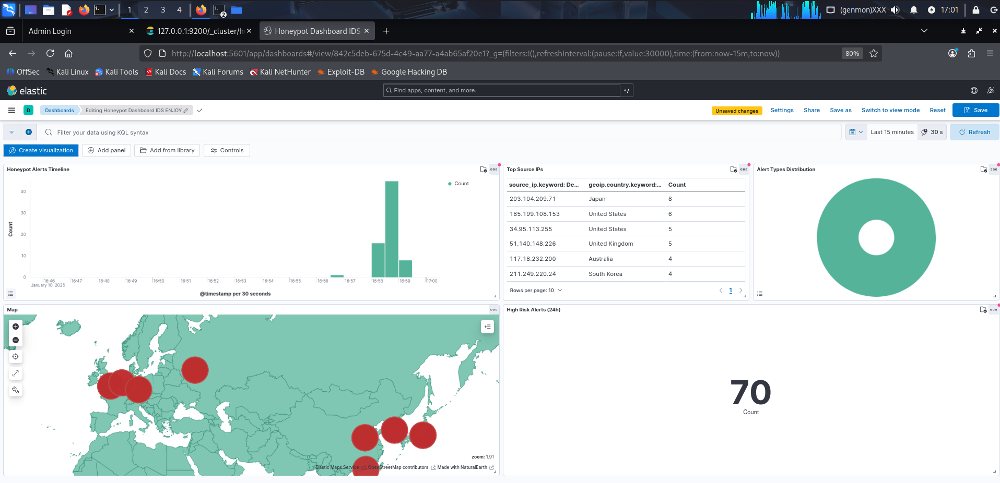
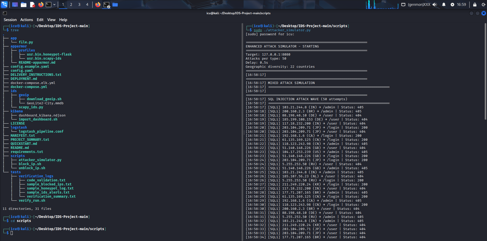

# 🛡️ IDS Honeypot with AppArmor & ELK Integration

[](https://python.org)
[](https://docker.com)
[](https://elastic.co)
[](https://elastic.co)
[](LICENSE)

A compact, local proof-of-concept IDS + honeypot platform that integrates:
- Flask web honeypot (app/)
- Scapy-based IDS (ids/)
- AppArmor confinement (apparmor/)
- Integration with an existing ELK 8.15 (Elasticsearch, Logstash, Kibana)
- GeoIP enrichment (MaxMind GeoLite2-City)
- Automated iptables blocking and optional email alerts

> IMPORTANT: This project integrates with an existing ELK 8.15 installation by default. See Quick Start for an optional local ELK compose file.

---

## Screenshots

Honeypot & IDS setup and results (files included in repository root):

### IDS Setup


### Kibana Dashboard (Overview)


### Attacks Simulation (IDS detects & logs)


---

## Table of Contents
- [Overview](#overview)
- [Prerequisites](#prerequisites)
- [Quick Start](#quick-start)
- [Start ELK (optional)](#start-elk-optional)
- [Create Elasticsearch Index Template (required)](#create-elasticsearch-index-template-required)
- [Run Services](#run-services)
- [Import Kibana Dashboard](#import-kibana-dashboard)
- [Testing](#testing)
- [Troubleshooting](#troubleshooting)
- [Configuration Reference](#configuration-reference)
- [Security & Disclaimer](#security--disclaimer)
- [License & Contact](#license--contact)

---

## Overview

This project demonstrates an integrated IDS + honeypot pipeline:
1. Attacks hit the honeypot (Flask app) or are observed by the Scapy IDS.
2. Events are logged in JSON, optionally sent to Logstash (TCP/UDP).
3. Logstash enriches with GeoIP and forwards to Elasticsearch (index pattern: `honeypot-*`).
4. Kibana visualizes alerts, timelines and geolocation.

Use cases: local testing, research, SOC learning, and proof-of-concept deployments.

---

## Prerequisites

- Debian/Ubuntu (tested on Ubuntu 22.04)
- Python 3.10+
- Docker & docker-compose (if using local ELK)
- Existing ELK 8.15 (recommended) or optional local ELK via docker-compose.elk.yml
- Root/sudo for AppArmor, iptables, and raw sockets (Scapy)
- MaxMind account to download GeoLite2-City.mmdb

---

## Quick Start

1. Clone or place the repository:
   ```bash
   cd /opt
   git clone https://github.com/b1l4l-sec/IDS-Project.git
   cd IDS-Project
   ```

2. Create a Python virtual environment and install dependencies:
   ```bash
   python3 -m venv .venv
   source .venv/bin/activate
   pip install -r requirements.txt
   ```

3. Download GeoIP DB (required for maps):
   - Create a free account at MaxMind and download GeoLite2-City
   - Place `GeoLite2-City.mmdb` in `ids/geoip/` (script helper available):
   ```bash
   cd ids/geoip
   bash download_geoip.sh
   cd ../..
   ```

4. Create log directory:
   ```bash
   sudo mkdir -p /var/log/honeypot_web
   sudo chown $USER:$USER /var/log/honeypot_web
   chmod 755 /var/log/honeypot_web
   ```

---

## Start ELK (optional)

If you don't have ELK running and want a local ELK for testing, use the provided compose:

```bash
# start local ELK (contains Elasticsearch, Logstash, Kibana)
docker-compose -f docker-compose.elk.yml up -d

# check containers
docker ps

# wait until Elasticsearch is ready
watch -n 2 'curl -s http://localhost:9200/_cluster/health | jq .'
```

Notes:
- By default xpack.security is disabled in the compose for lab/testing.
- If you already have an ELK, skip local compose and update `config.yaml` to point to your ELK host.

---

## Create Elasticsearch Index Template (REQUIRED — run BEFORE sending data)

If you start sending events before the correct mapping/template exists, indices may be created with the wrong mapping which causes Kibana issues. Run this command after Elasticsearch is available:

```bash
curl -X PUT "http://localhost:9200/_index_template/honeypot_template" -H 'Content-Type: application/json' -d'
{
  "index_patterns": ["honeypot-*"],
  "priority": 1,
  "template": {
    "mappings": {
      "properties": {
        "source": {
          "properties": {
            "ip": { "type": "ip" },
            "geo": {
              "properties": {
                "location": { "type": "geo_point" },
                "country_name": { "type": "keyword" },
                "city_name": { "type": "keyword" },
                "country_iso_code": { "type": "keyword" }
              }
            }
          }
        },
        "destination": {
          "properties": {
            "ip": { "type": "ip" }
          }
        },
        "@timestamp": { "type": "date" }
      }
    }
  }
}'
```

Verify template exists:

```bash
curl -X GET "http://localhost:9200/_index_template/honeypot_template?pretty"
```

If indices were created incorrectly, delete them and restart ingestion:
```bash
curl -X DELETE "http://localhost:9200/honeypot-*"
```

---

## Run Services (order recommended)

### Terminal 1 — Flask honeypot
```bash
source .venv/bin/activate
python3 app/file.py
# binds to 0.0.0.0:8080 by default
```

### Terminal 2 — Scapy IDS (requires root/capabilities)
Option A — run with sudo:
```bash
source .venv/bin/activate
sudo .venv/bin/python3 ids/scapy_ids.py
```

Option B — grant capabilities and run without sudo:
```bash
sudo setcap cap_net_raw,cap_net_admin=eip .venv/bin/python3
.venv/bin/python3 ids/scapy_ids.py
```

### Optional — Start Logstash (if using local or containerized Logstash)
If you used the local ELK compose, Logstash is already included. If you run Logstash on host, copy pipeline:

```bash
# on host Logstash
sudo cp logstash/logstash_pipeline.conf /etc/logstash/conf.d/honeypot.conf
sudo systemctl restart logstash
```

---

## Import Kibana Dashboard

Import the provided Kibana saved objects to get pre-built visualizations:

Option 1 — Kibana UI:
1. Open http://localhost:5601
2. Management → Stack Management → Saved Objects → Import
3. Select `kibana/dashboard_kibana.ndjson` (in `kibana/`)

Option 2 — API script:
```bash
cd kibana
bash import_dashboard.sh
```

Create data view pattern: `honeypot-*` and set the time field to `@timestamp`.

---

## Testing

Generate safe local traffic:

```bash
# Basic HTTP check
curl http://localhost:8080/
curl -X POST http://localhost:8080/login -d "username=admin&password=test"

# Simulate attacks (local only)
source .venv/bin/activate
python3 scripts/attacker_simulator.py --target localhost --count 10

# Check logs
tail -f /var/log/honeypot_web/honeypot.log
tail -f /var/log/honeypot_web/ids_alerts.log
```

Verify Elasticsearch indices:
```bash
curl http://localhost:9200/_cat/indices?v
curl http://localhost:9200/honeypot-*/_count?pretty
```

---

## Troubleshooting (most common issues)

- Elasticsearch memory / boot failure:
  ```bash
  sudo sysctl -w vm.max_map_count=262144
  echo "vm.max_map_count=262144" | sudo tee -a /etc/sysctl.conf
  ```

- Logstash connection refused:
  - Ensure Logstash is running and `logstash_pipeline.conf` exists.
  - Test connectivity: `nc -zv localhost 5000`

- No data in Kibana:
  - Ensure index template created (see above).
  - Verify data view `honeypot-*` exists and time range covers events.
  - Check Logstash and application logs.

- Scapy permission errors:
  ```bash
  sudo setcap cap_net_raw,cap_net_admin=eip .venv/bin/python3
  ```

- AppArmor denials:
  ```bash
  sudo aa-complain /etc/apparmor.d/usr.bin.honeypot-flask
  sudo apparmor_parser -r /etc/apparmor.d/usr.bin.honeypot-flask
  ```

---

## Configuration Reference

Primary config file: `config.yaml` (copy from `config.example.yaml`)

Key sections:
- `honeypot.port`, `honeypot.host`, `honeypot.log_file`
- `ids.interface`, `ids.threshold`, `ids.auto_block`
- `geoip.database_path`
- `elk.host`, `elk.port`, `elk.index_prefix`
- `logstash.host`, `logstash.port`

Set SMTP env vars for email alerts if needed (see README content in repo).

---

## Security & Disclaimer

- Only run attack simulations against systems you own or have explicit permission to test.
- Use this project in isolated / lab environments for safety.
- Do not expose honeypots on unprotected public interfaces without proper controls.

---

## Project Structure (high level)

```
IDS-Project/
├── app/                # Flask honeypot
├── ids/                # Scapy IDS and GeoIP utilities
├── logstash/           # Logstash pipeline
├── kibana/             # Dashboard export & import script
├── apparmor/           # AppArmor profiles
├── scripts/            # utilities (block/unblock/test)
├── docker-compose.elk.yml  # optional local ELK compose
├── config.example.yaml
├── config.yaml
├── requirements.txt
├── IDSSetUp.png
├── IDSKibana.png
└── IDSAttacksSimulation.png
```

---

## License & Contact

Licensed under MIT. See `LICENSE`.

For questions or support: lbienbilal@gmail.com

---

Thank you — copy this file into `README.md` (replace existing), commit and push. If you want, I can open a PR with this README update or push it directly for you. Which would you prefer?
